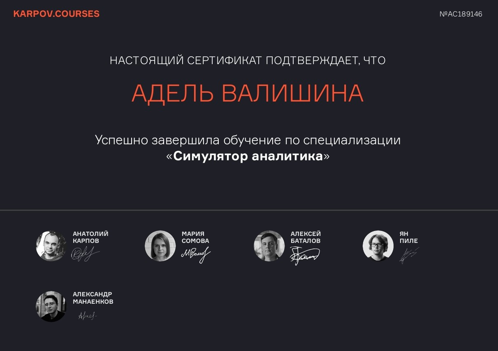

# 👋 Привет! Меня зовут Адель, я Data Analyst с бэкграундом в прикладной математике и нефтегазе

---
## 💼 Мои навыки и профессиональный опыт

🔬 Мой опыт работы в нефтегазовой отрасли сформировал сильные навыки работы с данными, автоматизации процессов и аналитики:

- **Сбор, обработка и агрегация данных** по различным источникам (скважины, пласты)
- **Разработка парсеров** для извлечения и структурирования информации
- **Автоматизация расчётных процессов** и построение пайплайнов с прозрачным логированием
- **Построение визуализаций**: графики, 3D-модели, интерактивные отчёты
- **Создание аналитических отчётов** (PDF-документы) с акцентом на практическое применение результатов
- **Работа с большими объемами данных** и оптимизация обработки
- **A/B тестирование**: постановка гипотез, расчёт метрик, анализ результатов
- **Владение инструментами**: SQL, Python (pandas, numpy, matplotlib, seaborn), Power BI, Tableau

📈 Сейчас я активно развиваюсь в аналитике данных:
- Изучаю продвинутый SQL, Airflow, продвинутую статистику и BI-инструменты
- Работаю над пет-проектами в области BI и аналитики
- Развиваюсь через платформы **Stepik**, курсы и собственные проекты
- Открыта к новым возможностям и предложениям в сфере **Data Analytics**

⚡ В свободное время увлекаюсь вязанием, читаю литературу по психологии и занимаюсь йогой 🧘‍♀️

## 🧠 Немного обо мне

🎓 Выпускница Казанского федерального университета по направлению *Информационные системы и технологии*. Более 2 лет работаю программистом-математиком в компании **Sofoil**, где занимаюсь расчётами и визуализацией данных по нефтегазовым месторождениям.

---

## 💡 Почему я в аналитике

Для меня важно, чтобы моя работа приносила **практическую пользу**. Именно поэтому я пришла в аналитику: на основе правильно интерпретированных данных можно принимать обоснованные решения, влияющие на бизнес и продукт.

Обожаю **структурировать информацию**, **автоматизировать процессы**, находить закономерности и превращать «хаос данных» в понятную историю.

## 📜 Сертификат о стажировке

---

## 📋 Мои проекты

| 📌 Название проекта              | 🎯 Цель проекта                                          | 🧰 Стек                           |
|----------------------------------|----------------------------------------------------------|----------------------------------|
| Анализ онлайн-продаж            | Определить факторы, влияющие на повторные покупки        | SQL, Python (pandas), Tableau   |
| Построение воронки продаж       | Проанализировать поведение пользователей на сайте        | Python, Power BI                |
| Автоматизация отчетов           | Сократить время подготовки аналитической отчетности      | Python (pandas, ReportLab)      |
| A/B тестирование гипотез        | Проверить гипотезу о влиянии изменений на поведение      | Python (SciPy, Statsmodels)     |

📎 *Подробнее — в репозиториях на [GitHub](#)*  

## 🛠️ Языки и инструменты

  
  
  
  
  
  
  
  
  
  
  
  
  

---

## 📫 Контакты

- Telegram: [@tsomll](https://t.me/tsomll)
- Email: adelvalishinaa@yandex.ru

---

